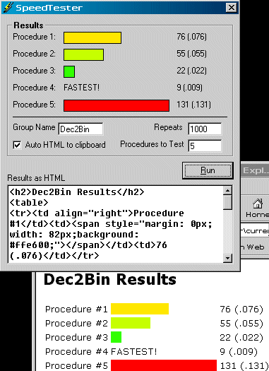



## Procedure Speed Tester

### Description

* 2003-11-04 UPDATE * Fixed "subscript out of range" bug. Thanks R. Gilchrist. Added HTML to clipboard. Thanks R.Rayment.

-- This is a quickly built utility app that can run procedures a user-specified amount of times

and graphically (and via HTML) display the speed results.

--This app is not meant to super accurate down to the nanosecond. It is just meant to give a rough idea on the speed of various procedures and more importantly the relative fastness or slowness of one procedure compared to another.
 
### More Info
 

             |
---                |---
**Submitted On**   |2003-11-04 19:13:26
**By**             |[redbird77](https://github.com/Planet-Source-Code/PSCIndex/blob/master/ByAuthor/redbird77.md)
**Level**          |Intermediate
**User Rating**    |5.0 (10 globes from 2 users)
**Compatibility**  |VB 5\.0, VB 6\.0
**Category**       |[Complete Applications](https://github.com/Planet-Source-Code/PSCIndex/blob/master/ByCategory/complete-applications__1-27.md)
**World**          |[Visual Basic](https://github.com/Planet-Source-Code/PSCIndex/blob/master/ByWorld/visual-basic.md)
**Archive File**   |[Procedure\_1667711142003\.zip](https://github.com/Planet-Source-Code/redbird77-procedure-speed-tester__1-49596/archive/master.zip)

